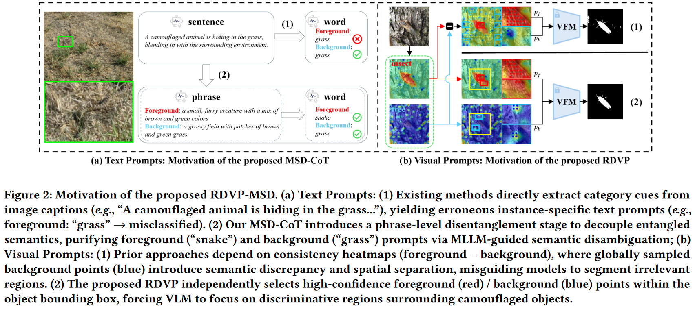
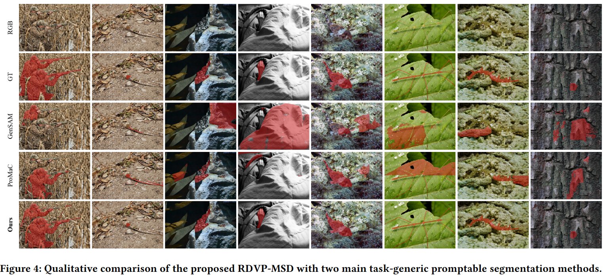
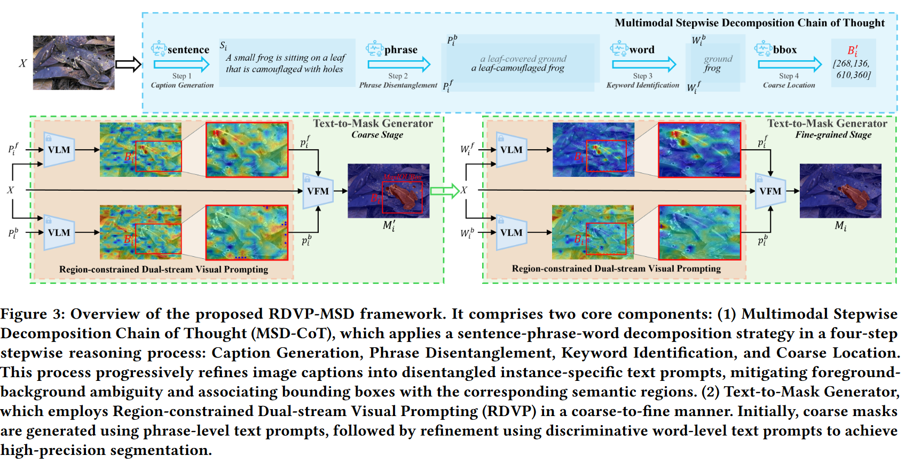

# :fire: RDVP-MSD (ACM MM 2025)

Code release of paper:

[**Stepwise Decomposition and Dual-stream Focus: A Novel Approach for Training-free Camouflaged Object Segmentation**](https://arxiv.org/abs/2506.06818)

[Chao Yin](https://github.com/ycyinchao/), Hao Li, Kequan Yang, Jide Li, Pinpin Zhu, Xiaoqiang Li

Shanghai University, University of the Chinese Academy of Sciences

<a href='https://arxiv.org/abs/2506.06818'></a> <a href='https://github.com/ycyinchao/RDVP-MSD/'></a> <a href='#demo'></a>

## :rocket: 1.News
* **[2025.8.15]** [Demo](#4.Demo) of RDVP-MSD is released.
* **[2025.8.14]** the code of RDVP-MSD is released.
* **[2025.8.14]** the results of the LLaVA1.5 version RDVP-MSD on multiple COS datasets are released.

<p align="center">
  
</p>
<p align="center">
  
</p>

## :bulb: 2.Highlight

While promptable segmentation (*e.g.*, SAM) has shown promise for various segmentation tasks, it still requires manual visual prompts for each object to be segmented. In contrast, task-generic promptable segmentation aims to reduce the need for such detailed prompts by employing only a task-generic prompt to guide segmentation across all test samples. However, when applied to Camouflaged Object Segmentation (COS), current methods still face two critical issues: 1) ***semantic ambiguity in getting instance-specific text prompts***, which arises from insufficient discriminative cues in holistic captions, leading to foreground-background confusion; 2) ***semantic discrepancy combined with spatial separation in getting instance-specific visual prompts***, which results from global background sampling far from object boundaries with low feature correlation, causing SAM to segment irrelevant regions. To mitigate the issues above, we propose **RDVP-MSD**, a novel training-free test-time adaptation framework that synergizes **R**egion-constrained **D**ual-stream Visual **P**rompting (RDVP) via **M**ultimodal Stepwise **D**ecomposition Chain of Thought (MSD-CoT).

MSD-CoT progressively disentangles image captions to eliminate semantic ambiguity, while RDVP injects spatial constraints into visual prompting and independently samples visual prompts for foreground and background points, effectively mitigating semantic discrepancy and spatial separation. 

## 3.Quick Start
### 3.1 Dataset
1. Download the datasets from the follow links:
   

**Camouflaged Object Segmentation Datasets**

- **[NC4K](https://github.com/JingZhang617/COD-Rank-Localize-and-Segment)**
- **[COD10K](https://github.com/DengPingFan/SINet/)**
- **[CAMO](https://drive.google.com/open?id=1h-OqZdwkuPhBvGcVAwmh0f1NGqlH_4B6)**
- **[CHAMELEON](https://www.polsl.pl/rau6/datasets/)**
2. Put it in `../Dataset/TestDataset/`.

### 3.2 Create and activate conda environment

```bash
# create and activate conda environment
conda create -n RDVP-MSD python=3.8
conda activate RDVP-MSD
# pip install torch
pip install torch==2.4.0 torchvision==0.19.0 torchaudio==2.4.0 --index-url https://download.pytorch.org/whl/cu118
# LLaVA
cd LLaVA-1.1.0
pip install --upgrade pip  # enable PEP 660 support
pip install -e .
cd ..
# SAM-HQ
pip install segment-anything-hq

pip install opencv-python imageio ftfy
```

### 3.3 Test

Our RDVP-MSD is a training-free test-time adaptation approach, so you can play with it by running:

```bash
CUDA_VISIBLE_DEVICES=0,1 python main.py --config config/COD10K_LLaVA1.5.yaml --save_path ./res/prediction_RDVP_MSD/
```
The more qualitative results of RDVP-MSD on four benchmarks (NC4K, COD10K, CAMO, CHAMELEON) have already been stored in [Google Drive](https://drive.google.com/file/d/1hXv3FRA-5q3IdZIji6a5u76P8PTpZi0Y/view?usp=sharing), please unzip it into the fold './res/'.

### 3.4Eval

evaluate the results on COD10K dataset: 

```bash
python eval/test_metrics.py
```

The quantitative results will be save in `./res/prediction_RDVP_MSD/log.txt`

The more results of evaluation are also in [Google Drive](https://drive.google.com/file/d/1hXv3FRA-5q3IdZIji6a5u76P8PTpZi0Y/view?usp=sharing).

 ## 4.Demo

 We further prepare a [jupyter notebook demo](https://github.com/ycyinchao/RDVP-MSD/blob/main/demo.ipynb) for visualization.
 1. Complete the following steps in the shell before opening the jupyter notebook. \
 The virtualenv environment named RDVP-MSD needs to be created first following [Quick Start](#3.2Create and activate conda environment).
```
pip install notebook 
pip install ipykernel ipywidgets
python -m ipykernel install --user --name RDVP-MSD
```
 2. Open demo.ipynb and select the '-' kernel in the running notebook.


 ## 5.TO-DO LIST
- [x] Update datasets and implementation scripts
- [x] Demo and Codes


## 6.Citation

If you find our work useful in your research, please consider citing:

```
@inproceedings{yin2025stepwise,
  title={Stepwise Decomposition and Dual-stream Focus: A Novel Approach for Training-free Camouflaged Object Segmentation},
  author={Yin, Chao and Li, Hao and Yang, Kequan and Li, Jide and Zhu, Pinpin and Li, Xiaoqiang},
  booktitle={ACM MM},
  year={2025}
}
```

## 7.License

The source code is free for research and education use only. Any commercial use should get formal permission first.

##  8.:cupid: Acknowledgements

- [SAM-HQ](https://github.com/SysCV/sam-hq)
- [LLaVA](https://github.com/haotian-liu/LLaVA)
- [CLIP Surgery](https://github.com/xmed-lab/CLIP_Surgery)
- [GenSAM](https://github.com/jyLin8100/GenSAM)

